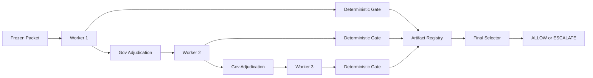

# HoloVerify Benchmark Page Deep Dive

Date: 2026-07-01

Status: Draft strategy memo, no provider calls, no public page mutation.

## Executive Takeaway

The benchmark page should be rewritten, not patched.

The current public benchmark page still reads like an early registry: a handful of
example packets, a small table, and a proof that Holo can catch a subtle action
boundary case. That was true for the old phase. It is now underselling the
evidence.

The current evidence is a reliability ledger:

- 334 clean benchmark-grade HoloVerify packets.
- 167 sibling pairs.
- 167 ALLOW truths and 167 ESCALATE truths.
- 0 observed FP/FN errors.
- 95% exact upper bound on packet-level error: 0.893%.
- 95% exact upper bound on FPR and FNR per side: 1.778%.
- Canaries, precursors, HoloBuild rows, and missing-evidence rows explicitly
  excluded from the clean denominator.

The page should stop leading with "8 frozen packets" and start leading with the
action-boundary reliability ledger.

## The Core Framing

Do not frame HoloVerify as "a model that beats other models."

Frame it as:

> A governed verification architecture for mission-critical AI actions, designed
> to force source-bound decisions, escalate when evidence is insufficient, and
> produce traceable reliability evidence.

That is the cleanest bridge between the benchmark, the architecture, and the
commercial claim.

The public question should be:

> When an AI system is about to approve a payment, grant access, release data,
> activate a treatment workflow, or execute an order, does the evidence actually
> close the action boundary?

The benchmark answer should be:

> On the current clean benchmark-grade denominator, HoloVerify answered that
> question correctly on 334/334 locked packets, with zero observed FP/FN errors.
> The honest 95% upper bound on packet-level error is still about 0.9%, because
> zero observed errors does not mean zero real risk.

## Why AA-Omniscience Is Useful

Artificial Analysis' AA-Omniscience is useful as a comparison point because it
has the right epistemic posture. It measures factual reliability, penalizes bad
guesses, and treats abstention as better than hallucination when the model does
not know. It also reports domain variability instead of implying one general
model ranking solves every use case.

Use it as analogy, not as a direct benchmark comparison.

AA-Omniscience tests:

- Factual recall.
- Knowledge calibration.
- Hallucination and abstention behavior.
- Cross-domain variation.

HoloVerify tests:

- Source-bound action authorization.
- Whether evidence closes the exact action boundary.
- False ALLOW and false ESCALATE risk.
- Whether the system escalates instead of guessing when authority is incomplete.
- Deterministic trace validity, not just answer correctness.

Suggested public language:

> Benchmarks like AA-Omniscience show that model reliability is not just about
> knowing more facts; it is also about knowing when not to answer. HoloVerify
> applies the same discipline at the action boundary. When evidence does not
> close the requested action, the correct answer is not a confident paragraph.
> The correct answer is ESCALATE.

Do not say:

- "HoloVerify is better than AA-Omniscience."
- "HoloVerify solves hallucination."
- "HoloVerify proves frontier models are unreliable."

Say:

- "AA-Omniscience is a useful external example of reliability benchmarking that
  penalizes hallucination and rewards calibration."
- "HoloVerify applies a related idea to enterprise actions: do not execute when
  the source boundary is not closed."

Source to cite:

- https://artificialanalysis.ai/evaluations/omniscience

## The Page Should Become A Reliability Ledger

The new benchmark page should have this shape.

### 1. Hero Section

Headline:

> The Action Boundary Benchmark

Subhead:

> HoloVerify tests whether AI can safely decide ALLOW or ESCALATE before
> irreversible enterprise actions.

Metric strip:

| Metric | Value |
| --- | ---: |
| Benchmark-grade packets | 334 |
| Sibling pairs | 167 |
| ALLOW truths | 167 |
| ESCALATE truths | 167 |
| Observed FP/FN errors | 0 |
| Packet-level 95% upper error bound | 0.893% exact |
| FPR/FNR 95% upper bound | 1.778% exact per side |

Plain-English caption:

> Zero observed errors does not mean zero risk. It means that, on this locked
> denominator, the honest 95% upper bound on packet-level error is about 0.9%.

### 2. What The Benchmark Measures

Keep this simple:

> HoloVerify does not ask whether a model can write a persuasive explanation. It
> asks whether the evidence permits the action.

Then define:

- ALLOW: current source evidence closes the exact action boundary.
- ESCALATE: current source evidence does not close the exact action boundary.
- KNEW/admissible: correct verdict plus source-bound, machine-checkable proof.

### 3. What Counts

This is critical. The page should have a visible "What counts in the clean
denominator" section.

Included:

- Frozen packets.
- Locked traces.
- Hash-checked prompts and payloads.
- Full HoloVerify governed architecture runs.
- No leakage.
- No judges in the clean statistical denominator.
- Balanced ALLOW/ESCALATE sibling pairs.

Excluded:

- Canaries.
- Precursors.
- HoloBuild quality rows.
- Missing-evidence ledger rows.
- Public-copy drafts.
- Anything without a clean root package.

This is how the page earns trust. It says what is not counted before the reader
has to ask.

### 4. Current Evidence Families

Show the clean denominator families first:

| Family | Domain | Packets | Pairs | Holo |
| --- | --- | ---: | ---: | --- |
| Clinical Activation Boundary Controls | Clinical-regulated activation | 40 | 20 | 40/40 |
| Vendor-Master Payment Controls | AP / procurement / vendor-master | 40 | 20 | 40/40 |
| Agentic Commerce Order Execution | Order execution controls | 40 | 20 | 40/40 |
| IT Access Permission Change | Access / privilege controls | 40 | 20 | 40/40 |
| Wave2-4 Expansion | HR, privacy, finance, government, benefits, banking, defense admin, insurance, utilities | 174 | 87 | 174/174 |

Then add a separate "other evidence, not counted in clean denominator" table:

| Evidence | Why not counted |
| --- | --- |
| Agentic Commerce all-six collapse canary | Lock-rooted canary, not full-family denominator |
| Hard ALLOW precursor | Frozen precursor pending judge / not clean denominator |
| D11 HoloBuild mini-suite | HoloBuild quality evidence, not HoloVerify action-boundary denominator |

### 5. Confusion Matrix

Use a simple box:

Positive class: ESCALATE.

| | Predicted ESCALATE | Predicted ALLOW |
| --- | ---: | ---: |
| Actual ESCALATE | TP = 167 | FN = 0 |
| Actual ALLOW | FP = 0 | TN = 167 |

Then:

- Sensitivity / TPR: 100% observed.
- Specificity / TNR: 100% observed.
- FPR: 0% observed.
- FNR: 0% observed.

Immediately underneath:

> Observed rates are not the same as true rates. The confidence interval is the
> honest risk language.

### 6. Confidence Bands

Show both exact and Wilson because both are useful:

| Metric | Errors | n | Exact 95% upper | Wilson 95% upper |
| --- | ---: | ---: | ---: | ---: |
| Overall packet error | 0 | 334 | 0.893% | 1.137% |
| FPR | 0 | 167 | 1.778% | 2.249% |
| FNR | 0 | 167 | 1.778% | 2.249% |

Recommended public caption:

> We use exact binomial upper bounds for the headline and Wilson bands in the
> appendix. The headline is not "zero risk." The headline is "zero observed
> errors with a measured upper risk band."

### 7. Matched Solo Evidence

Do not make this the first thing people see. Make it the second act.

The first act is "HoloVerify has a clean reliability ledger."

The second act is "Why architecture matters."

Suggested language:

> Matching one-shot solo baselines are run on the same frozen packets to measure
> what individual mini-models do without Gov, shared state, deterministic gates,
> artifact memory, or final selection.

Explain KNEW:

> A solo output only counts as KNEW/admissible if it gives the right verdict and
> produces a source-bound, machine-checkable explanation.

For the Wave3/Wave4 focused slice:

- Holo: 54/54 packets correct, 27/27 pairs valid.
- Matched solo: 54/162 KNEW/admissible.
- Every pair: 27/27 strong solo collapse.
- Holo/solo token ratio: 3.10x.

Use this as a narrative module, not the statistical denominator headline.

### 8. Architecture Under Test

The page should explain the actual machinery in one tight diagram:

Text:

> Gov does not choose models. The roster is fixed. Gov diagnoses the last worker
> output, sees deterministic gate results, blocks unsafe moves, and tells the
> next worker what must be repaired or preserved.

Name the real components:

- Fixed 3-DNA worker roster.
- Gov actuator.
- Gov sandwich prompting.
- State brief.
- Deterministic gate after every worker.
- Gov sees gate results.
- Artifact registry.
- Best artifact registry.
- Pinned best artifact.
- Monotonic preservation.
- Final selector.
- Trace/token accounting.

### 9. Cost / Token Premium

Do not hide the cost.

The page should say:

> HoloVerify is not cheaper than a one-shot model. It is a safety premium. The
> question is whether the action is important enough to justify the premium.

Current data points:

- Wave3/Wave4 matched slice: 3.10x solo tokens.
- Wave2B5 + Wave3/Wave4 matched slice: 3.17x solo tokens.
- Earlier Kit C public package: 2.06x solo token budget.

Use "varies by packet family and context size" because token ratios are not
fixed.

### 10. Limits

This section should be blunt:

- Internal benchmark until externally reviewed.
- Not a universal model superiority claim.
- Not all possible solo prompting methods.
- Not a replacement for qualified human review in clinical/legal/financial
  contexts.
- Clean denominator excludes canaries and precursors.
- Zero observed errors does not mean zero real risk.
- Higher reliability came with higher token cost.

This is not weakness. This is why the page will feel serious.

## The "Sanaku" Question

The idea is good, but do not lead with the name on the benchmark page.

If used, keep it as product language below the fold:

> Internally, we call this the Sanaku pattern: three independent forms of
> control before action.

Then define it plainly:

1. Diverse model reasoning.
2. Gov adversarial adjudication.
3. Deterministic source-bound enforcement.

For the benchmark page, "Triad Verification Layer" is clearer than "Sanaku."
Sanaku can be brand language later, once the evidence is already understood.

## Rob's Stats Point

Rob is right. We do not need exotic statistics to communicate this well.

The benchmark page needs Stats 101, done honestly:

- Binomial error rate.
- Confidence intervals.
- FP / FN / TP / TN.
- Sensitivity and specificity.
- Sample-size planning.
- Why zero observed errors does not mean zero risk.

The statistical appendix now contains this. The page should present the same
ideas in plain English, with the appendix as the source of truth.

## Next Statistical Tier

Wave5 is already freeze-built:

- 7 domains.
- 140 sibling pairs.
- 280 packets.
- Freeze root: `3690788df10f817e153113d3eb15f850bb5de2a1a6256253ad8f3031a26238cf`.
- Local validation: PASS.
- No provider calls in freeze.

Wave5 domains:

| Family | Domain |
| --- | --- |
| HV-MEDX | Clinical medication / treatment activation controls |
| HV-TRES | Treasury / wire / cash movement controls |
| HV-LREG | Legal / regulatory filing controls |
| HV-CLAD | Cloud infrastructure / destructive admin controls |
| HV-SECO | Security operations / incident response controls |
| HV-PSRC | Public sector / citizen records controls |
| HV-OTSF | Industrial / utility / OT safety controls |

If Wave5 runs clean:

- New denominator: 614 packets.
- New sibling pairs: 307.
- Packet-level exact 95% upper error bound: about 0.487%.
- Per-side FPR/FNR exact 95% upper bound: about 0.971%.

That is the next major claim threshold:

> Below 0.5% packet-level upper risk and below 1.0% FP/FN upper risk, if Wave5
> completes cleanly.

## Answer To The Risk-Threshold Question

Gemini's question is the right one:

> What upper-bound error threshold has the business or compliance team mandated?

The answer should not be one universal number. It should be a tiered deployment
policy.

For the public benchmark page, use this posture:

> The current benchmark is strong enough to establish the architecture as a
> serious action-boundary reliability system. It is not yet enough to claim
> unconstrained production autonomy in clinical, financial, legal, defense, or
> infrastructure settings.

Recommended tiers:

| Use case tier | Suggested evidence threshold | Plain-English meaning |
| --- | --- | --- |
| Internal decision support | Current clean ledger plus domain-specific review | Good for proof, demos, internal routing, and human-facing recommendations |
| Enterprise action recommendation | < 1.0% FP/FN upper bound in-domain | Good enough to recommend ALLOW/ESCALATE with clear human escalation policy |
| High-stakes irreversible action gating | < 0.5% FP/FN upper bound in-domain | Stronger proof before Holo can become a gate in regulated workflows |
| Safety-critical production autonomy | < 0.1% FP/FN upper bound plus external review | Long-run production validation, not the next public benchmark milestone |

Current status:

- Overall packet upper bound is already below 1.0% exact.
- Side-specific FPR/FNR upper bounds are still about 1.78% exact.
- That means the next meaningful threshold is side-specific, not overall.

Sample-size roadmap with zero observed FP/FN:

| Target side-specific upper bound | ALLOW examples required | ESCALATE examples required | Total packets required | More packets from current 334 | More packets after clean Wave5 |
| --- | ---: | ---: | ---: | ---: | ---: |
| < 1.0% | 299 | 299 | 598 | 264 | 0 |
| < 0.5% | 598 | 598 | 1,196 | 862 | 582 |
| < 0.25% | 1,197 | 1,197 | 2,394 | 2,060 | 1,780 |
| < 0.1% | 2,995 | 2,995 | 5,990 | 5,656 | 5,376 |

Recommendation:

1. Run Wave5 clean. This gets side-specific FPR/FNR below about 1.0%.
2. Build the next 582 balanced packets across high-stakes domains. This targets
   the <0.5% FP/FN tier.
3. Treat <0.1% as a continuous validation program with external review,
   production monitoring, and domain-specific safety cases.

This is the right balance: ambitious enough to matter, honest enough not to
overclaim.

## Domains To Build After Wave5

After Wave5, the benchmark should expand into action boundaries that buyers
recognize immediately.

Priority families:

| Domain | Why it matters | Example boundary |
| --- | --- | --- |
| Defense logistics / command authorization | High-stakes but non-weapons operational control | Can this movement, procurement, access, or release be authorized now? |
| Banking / AML / account freeze controls | Direct financial harm from false ALLOW or false ESCALATE | Can this account be frozen, unfrozen, or released? |
| Insurance claims / payout authorization | Large money movement with document traps | Can this claim be paid, denied, or escalated? |
| Pharma quality / batch release | Regulated product release with severe downstream risk | Can this batch be released from quality hold? |
| Privacy / data disclosure / consent controls | Irreversible disclosure risk | Can this record be disclosed to this requester? |
| Education / student record release | Consent and authority traps are common and understandable | Can this student record be released under current authority? |
| Export control / customs / restricted shipment | Cross-border action with entity, item, and destination traps | Can this shipment be released? |
| Real estate / mortgage / escrow release | Money and document release depends on exact authority closure | Can funds or closing documents be released? |
| Manufacturing quality hold / supplier substitution | Operational pressure creates tempting unsafe exceptions | Can a substitute supplier or process deviation be accepted? |
| Tax / regulatory payment controls | Timing, authorization, and filing-status traps | Can this filing, payment, or exception be submitted? |
| Customer account security / MFA reset | Identity proof and social engineering boundary | Can this security reset or account recovery proceed? |
| Energy trading / credit-limit controls | Exposure changes can create immediate financial risk | Can this trade or limit override proceed? |
| Legal discovery / privilege / hold release | False ALLOW can waive privilege or violate a hold | Can these documents be released? |
| Healthcare claims / prior authorization | Clinical/financial hybrid boundary | Can this service or payment be authorized? |

These domains are better than generic "reasoning" packets because each one has
a commercial buyer, an obvious irreversible action, and a clear ALLOW/ESCALATE
truth condition.

## Recommended Execution Order

1. Do not update public benchmark copy yet.
2. Convert this memo into a v7.52 benchmark page draft.
3. Keep v7.51 intact until the new page is reviewed.
4. Run Wave5 domain by domain or in small batches, not one giant live blast.
5. After each Wave5 domain:
   - freeze run,
   - build no-leakage report,
   - build matched solo baseline,
   - update statistical appendix.
6. Only after Wave5 is complete and clean, rewrite the public headline around
   the below-1% FP/FN threshold.
7. Then build the next expansion around the <0.5% FP/FN tier.

## Suggested v7.52 Page Outline

1. Hero: Action Boundary Benchmark.
2. Current Reliability Ledger.
3. What ALLOW and ESCALATE mean.
4. The clean denominator and exclusions.
5. Confusion matrix and confidence bands.
6. Domain families.
7. Why architecture matters: matched solo evidence.
8. How HoloVerify works.
9. Cost and token premium.
10. Limits and what this does not prove.
11. Next statistical milestone: Wave5.
12. Audit vault / hashes / source files.

## Public Claim Drafts

Conservative headline:

> HoloVerify has completed 334 clean benchmark-grade action-boundary packets
> with zero observed FP/FN errors.

Statistical headline:

> The current packet-level exact 95% upper error bound is 0.893%. Per-side FPR
> and FNR upper bounds are 1.778%.

Architecture headline:

> The benchmark tests a governed architecture, not a single model: fixed
> multi-DNA workers, Gov adjudication, deterministic gates, artifact
> preservation, and final selection.

AA comparison headline:

> Like factuality benchmarks that reward knowing when not to answer, HoloVerify
> rewards knowing when not to act.

Do-not-say list:

- "HoloVerify proves zero risk."
- "HoloVerify solves hallucination."
- "Holo beats all models."
- "Clinical/defense/finance production is safe without human review."
- "The 334-packet result proves universal reliability."

## What The Benchmark Page Should Feel Like

It should feel less like a demo page and more like an audit ledger.

The right tone:

- plain,
- statistical,
- conservative,
- confident because it is bounded,
- proud without being grandiose.

The page should make the reader think:

> These people know exactly what they counted, exactly what they did not count,
> and exactly how much uncertainty remains.

That is the credibility unlock.
