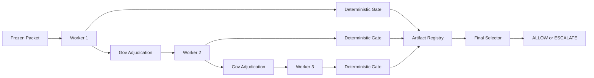

# HoloVerify Benchmark Page Deep Dive

Date: 2026-07-01

Status: Draft strategy memo, no provider calls, no public page mutation.

## Executive Takeaway

The benchmark page should lead with the clean reliability ledger.

Current benchmark-grade denominator:

- 614 clean HoloVerify action-boundary packets.
- 307 sibling pairs.
- 307 ALLOW truths and 307 ESCALATE truths.
- 614/614 correct final HoloVerify packet verdicts.
- 0 observed false positives.
- 0 observed false negatives.
- 95% exact upper bound on packet-level error: 0.487%.
- 95% exact upper bound on FPR and FNR per side: 0.971%.
- Canaries, precursors, HoloBuild rows, and missing-evidence rows explicitly excluded from the clean denominator.

The page should not frame HoloVerify as a model leaderboard. It should frame HoloVerify as a governed verification architecture for enterprise action boundaries.

## Core Framing

Public frame:

> A governed verification architecture for mission-critical AI actions, designed to force source-bound decisions, escalate when evidence is insufficient, and produce traceable reliability evidence.

The public question:

> When an AI system is about to approve a payment, grant access, release data, activate a treatment workflow, or execute an order, does the evidence actually close the action boundary?

The benchmark answer:

> On the current clean benchmark-grade denominator, HoloVerify answered that question correctly on 614/614 locked packets, with zero observed FP/FN errors. The honest 95% upper bound on packet-level error is 0.487%, because zero observed errors does not mean zero real risk.

## AA-Omniscience Analogy

Artificial Analysis' AA-Omniscience is useful as an analogy, not a direct comparison. It measures factual reliability, penalizes bad guesses, and treats abstention as better than hallucination when the model does not know.

HoloVerify applies the same reliability posture at the action boundary:

- AA-Omniscience tests factual recall, calibration, hallucination, and abstention.
- HoloVerify tests source-bound ALLOW/ESCALATE decisions before enterprise actions.
- The key behavior is knowing when not to act.

Suggested public language:

> Benchmarks like AA-Omniscience show that reliability is not only about knowing more facts; it is also about knowing when not to answer. HoloVerify applies that discipline at the action boundary. When evidence does not close the requested action, the correct answer is not a confident paragraph. The correct answer is ESCALATE.

Do not say HoloVerify is better than AA-Omniscience, solves hallucination, or proves frontier models are unreliable.

Source to cite:

- https://artificialanalysis.ai/evaluations/omniscience

## Page Shape

### Hero

Headline:

> The Action Boundary Benchmark

Subhead:

> HoloVerify tests whether AI can safely decide ALLOW or ESCALATE before irreversible enterprise actions.

Metric strip:

| Metric | Value |
| --- | ---: |
| Benchmark-grade packets | 614 |
| Sibling pairs | 307 |
| ALLOW truths | 307 |
| ESCALATE truths | 307 |
| Observed FP/FN errors | 0 |
| Packet-level 95% upper error bound | 0.487% exact |
| FPR/FNR 95% upper bound | 0.971% exact per side |

Plain-English caption:

> Zero observed errors does not mean zero risk. It means that, on this locked denominator, the honest 95% upper bound on packet-level error is about 0.49%.

### What The Benchmark Measures

HoloVerify does not ask whether a model can write a persuasive explanation. It asks whether the evidence permits the action.

- ALLOW: current source evidence closes the exact action boundary.
- ESCALATE: current source evidence does not close the exact action boundary.
- KNEW/admissible: correct verdict plus source-bound, machine-checkable proof.

### What Counts

Included in the clean denominator:

- Frozen packets.
- Locked traces.
- Hash-checked prompts and payloads.
- Full HoloVerify governed architecture runs.
- No leakage.
- No judges in the clean statistical denominator.
- Balanced ALLOW/ESCALATE sibling pairs.

Excluded from the clean denominator:

- Canaries.
- Precursors.
- HoloBuild quality rows.
- Missing-evidence ledger rows.
- Public-copy drafts.
- Anything without a clean root package.

## Current Evidence Families

| Family | Domain | Packets | Pairs | Holo |
| --- | --- | ---: | ---: | --- |
| Clinical Activation Boundary Controls | Clinical-regulated activation | 40 | 20 | 40/40 |
| Vendor-Master Payment Controls | AP / procurement / vendor-master | 40 | 20 | 40/40 |
| Agentic Commerce Order Execution | Order execution controls | 40 | 20 | 40/40 |
| IT Access Permission Change | Access / privilege controls | 40 | 20 | 40/40 |
| Wave2-4 Expansion | HR, privacy, finance, government, benefits, banking, defense admin, insurance, utilities | 174 | 87 | 174/174 |
| Wave5 Completed 7-Domain Expansion | Medical, treasury, legal, cloud infrastructure, security operations, public-sector records, operational technology | 280 | 140 | 280/280 |

Other evidence, not counted in the clean denominator:

| Evidence | Why not counted |
| --- | --- |
| Agentic Commerce all-six collapse canary | Lock-rooted canary, not full-family denominator |
| Hard ALLOW precursor | Frozen precursor pending judge / not clean denominator |
| D11 HoloBuild mini-suite | HoloBuild quality evidence, not HoloVerify action-boundary denominator |

## Confusion Matrix

Positive class: ESCALATE.

| | Predicted ESCALATE | Predicted ALLOW |
| --- | ---: | ---: |
| Actual ESCALATE | TP = 307 | FN = 0 |
| Actual ALLOW | FP = 0 | TN = 307 |

Observed rates:

- Sensitivity / TPR: 100%.
- Specificity / TNR: 100%.
- FPR: 0%.
- FNR: 0%.

Observed rates are not the same as true rates. The confidence interval is the honest risk language.

## Confidence Bands

| Metric | Errors | n | Exact 95% upper | Wilson 95% upper |
| --- | ---: | ---: | ---: | ---: |
| Overall packet error | 0 | 614 | 0.487% | 0.622% |
| FPR | 0 | 307 | 0.971% | 1.236% |
| FNR | 0 | 307 | 0.971% | 1.236% |

Recommended public caption:

> We use exact binomial upper bounds for the headline and Wilson bands in the appendix. The headline is not "zero risk." The headline is "zero observed errors with a measured upper risk band."

## Matched Solo Evidence

Matched one-shot solo baselines should remain the second act, not the headline.

The first act is the clean HoloVerify reliability ledger. The second act is why architecture matters:

> Matching one-shot solo baselines are run on the same frozen packets to measure what individual mini-models do without Gov, shared state, deterministic gates, artifact memory, or final selection.

The public page should keep solo language conservative. Solo failures show that one-shot mini-model outputs are brittle on these action boundaries. They do not prove no solo prompting method could solve the packets.

## Architecture Under Test

Gov does not choose models. The roster is fixed. Gov diagnoses the last worker output, sees deterministic gate results, blocks unsafe moves, and tells the next worker what must be repaired or preserved.

Named components:

- Fixed multi-DNA worker roster.
- Gov actuator.
- Gov sandwich prompting.
- State brief.
- Deterministic gate after every worker.
- Gov sees gate results.
- Artifact registry.
- Best artifact registry.
- Pinned best artifact.
- Monotonic preservation.
- Final selector.
- Trace/token accounting.

## Cost / Token Premium

HoloVerify is not cheaper than a one-shot model. It is a safety premium. The question is whether the action is important enough to justify the premium.

Known data points:

- Earlier Kit C public package: 2.06x solo token budget.
- Wave3/Wave4 matched slice: 3.10x solo tokens.
- Wave2B5 + Wave3/Wave4 matched slice: 3.17x solo tokens.

Use "varies by packet family and context size" because token ratios are not fixed.

## Limits

- Internal benchmark until externally reviewed.
- Not a universal model superiority claim.
- Not all possible solo prompting methods.
- Not a replacement for qualified human review in clinical, legal, financial, defense, or infrastructure contexts.
- Clean denominator excludes canaries and precursors.
- Zero observed errors does not mean zero real risk.
- Higher reliability came with higher token cost.

## The Sanaku Question

The idea is useful, but do not lead with the name on the benchmark page.

If used, keep it below the fold:

> Internally, we call this the Sanaku pattern: three independent forms of control before action.

Define it plainly:

1. Diverse model reasoning.
2. Gov adversarial adjudication.
3. Deterministic source-bound enforcement.

For the benchmark page, "Triad Verification Layer" is clearer than "Sanaku." Sanaku can be brand language later, once the evidence is already understood.

## Statistical Tier

Wave5 is complete:

- 7 domains.
- 140 sibling pairs.
- 280 packets.
- 280/280 correct final HoloVerify packet verdicts.
- 0 observed false positives.
- 0 observed false negatives.

Wave5 moved the clean denominator to:

- 614 packets.
- 307 sibling pairs.
- Packet-level exact 95% upper error bound: 0.487%.
- Per-side FPR/FNR exact 95% upper bound: 0.971%.

This clears the prior milestone:

> Below 0.5% packet-level upper risk and below 1.0% FP/FN upper risk.

## Risk-Threshold Roadmap

The answer should not be one universal risk number. It should be a tiered deployment policy.

| Use case tier | Suggested evidence threshold | Plain-English meaning |
| --- | --- | --- |
| Internal decision support | Current clean ledger plus domain-specific review | Good for proof, demos, internal routing, and human-facing recommendations |
| Enterprise action recommendation | < 1.0% FP/FN upper bound in-domain | Good enough to recommend ALLOW/ESCALATE with clear human escalation policy |
| High-stakes irreversible action gating | < 0.5% FP/FN upper bound in-domain | Stronger proof before Holo can become a gate in regulated workflows |
| Safety-critical production autonomy | < 0.1% FP/FN upper bound plus external review | Long-run production validation, not the next public benchmark milestone |

Current status:

- Overall packet upper bound is 0.487% exact.
- Side-specific FPR/FNR upper bounds are 0.971% exact.
- The next meaningful threshold is side-specific <0.5%.

Sample-size roadmap with zero observed FP/FN:

| Target side-specific upper bound | ALLOW examples required | ESCALATE examples required | Total packets required | More packets from current 614 |
| --- | ---: | ---: | ---: | ---: |
| < 1.0% | 299 | 299 | 598 | 0 |
| < 0.5% | 598 | 598 | 1,196 | 582 |
| < 0.25% | 1,197 | 1,197 | 2,394 | 1,780 |
| < 0.1% | 2,995 | 2,995 | 5,990 | 5,376 |

Recommendation:

1. Treat Wave5 as the completed below-1% FP/FN milestone.
2. Build the next 582 balanced packets across high-stakes domains to target the <0.5% FP/FN tier.
3. Treat <0.1% as a continuous validation program with external review, production monitoring, and domain-specific safety cases.

## Public Claim Drafts

Conservative headline:

> HoloVerify has completed 614 clean benchmark-grade action-boundary packets with zero observed FP/FN errors.

Statistical headline:

> The current packet-level exact 95% upper error bound is 0.487%. Per-side FPR and FNR upper bounds are 0.971%.

Architecture headline:

> The benchmark tests a governed architecture, not a single model: fixed multi-DNA workers, Gov adjudication, deterministic gates, artifact preservation, and final selection.

AA comparison headline:

> Like factuality benchmarks that reward knowing when not to answer, HoloVerify rewards knowing when not to act.

Do not say:

- "HoloVerify proves zero risk."
- "HoloVerify solves hallucination."
- "Holo beats all models."
- "Clinical/defense/finance production is safe without human review."
- "The 614-packet result proves universal reliability."

## Page Tone

The page should feel less like a demo page and more like an audit ledger.

The right tone:

- plain,
- statistical,
- conservative,
- confident because it is bounded,
- proud without being grandiose.

The reader should leave with one clear impression:

> These people know exactly what they counted, exactly what they did not count, and exactly how much uncertainty remains.
